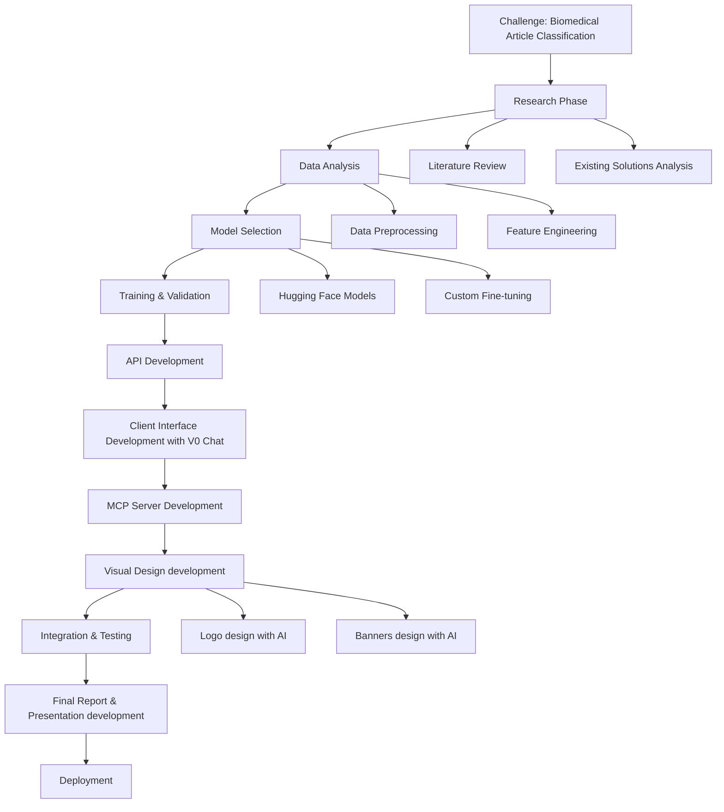
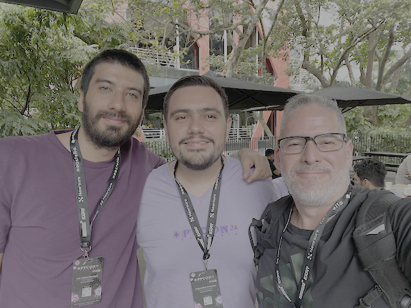

# AbstractGo


AbstractGo is an AI/ML solution for medical investigation classification based on title and abstracts.

## Table of Contents

- [Description](#description)
- [Features](#features)
- [Technologies](#technologies)
- [Getting Started](#getting-started)
  - [Prerequisites](#prerequisites)
  - [Installation](#installation)
- [Usage](#usage)
  - [Development Mode](#development-mode)
  - [MCP Server](#mcp-server-usage)
  - [Production Mode](#production-mode)
  - [Available Make Commands](#available-make-commands)
- [API Endpoints](#api-endpoints)
- [Secure Server Configuration](#secure-server-configuration)
- [Project Structure](#project-structure)
- [License](#license)
- [Contributing](#contributing)
- [Credits](#credits)

## Description

AbstractGo is an intelligent AI/ML system designed to classify biomedical literature using only article titles and abstracts as input. The system features streamlined FastAPI and FastMCP backends that serves a sophisticated **text-classification** ML model—built on [BioBERT](https://huggingface.co/dmis-lab/biobert-v1.1) with LoRA fine-tuning ([Hiver77/MDT](https://huggingface.co/Hiver77/MDT)) and hosted on [Hugging Face](https://huggingface.co). Complementing the backend is a modern Next.js dashboard that provides comprehensive insights through model performance metrics, confusion matrices, category distributions, and an interactive demo playground. The solution specializes in multi-label classification across four critical medical domains: **Cardiovascular, Neurological, Hepatorenal, and Oncological**.

## Features

- **Model-powered classification**: API and MCP server that scores input title+abstract with a [Transformers Hugging Face model](https://huggingface.co/Hiver77/MDT) (`text-classification`) based on [BioBERT](https://huggingface.co/dmis-lab/biobert-v1.1).
- **Interactive dashboard**: UI with metrics, confusion matrix, category distributions, performance trends, and a demo component to interact with the model and API.
- **MCP server**: MCP-compliant server based on FastAPI that serves the model and the dashboard with the same resources and tools as the API. For instructions to use it, see the [MCP Server README](./mcp-server/README.md).
- **PDF upload**: API and MCP server has the ability to score input PDF with a [OpenAI API](https://platform.openai.com/docs/api-reference/files) to extract the title and abstract.
- **Vercel V0 Chat**: [V0 Chat](https://v0.app/chat/abstract-go-rrzvfQyOCKc) with the UI vibe coding development. Visit this [url](https://v0.app/chat/abstract-go-rrzvfQyOCKc) to try it out.
- **Model Training Analysis**: in this [README](./notebooks/README.md) file there's the complete model training analysis and the [notebook](./notebooks/AbstractGo_Final_Training_Model.ipynb) has the off-line training steps. The model training datasets are in the [/data/raw](./data/raw) directory.
- **Jupiter and Google Colab Notebooks**: [notebooks](./notebooks) directory with the model training Jupiter notebook. Visit this [Google Colab notebook url](https://colab.research.google.com/drive/1BU1rwp86fsX2hpAha2WIvcIZGoHq3EnU#scrollTo=6WaQOLd5Hswh) to check the live step-by-step instructions we run to train the model.
- **Batch Classification**: [data-scripts/Test_model.py](./data-scripts/Test_model.py) script to batch-classify medical articles from a [CSV file](./data/raw/test.csv).
- **Containerized deployment**: `deploy/docker-compose.yml` with Nginx serving the client and reverse-proxying to the API, and production-ready for servers with containerized deployment.
- **Monorepo workflow**: Root `Makefile` orchestrates client and server tasks; npm workspaces for script aggregation.

## Technologies

### Backend
- **Python** (≥3.11)
- **FastAPI** (0.116.x)
- **Transformers** (4.55.x) with a BioBERT tokenizer
- **Uvicorn** (ASGI server)
- **Poetry** (dependency and environment management)
- **OpenAI API or AI/ML API** (to use the the PDF upload feature)

### MCP Server
- **MCP** (1.13.x)
- **FastAPI** (0.116.x)
- **Transformers** (4.55.x) with a BioBERT tokenizer
- **Poetry** (dependency and environment management)
- **OpenAI API or AI/ML API** (to use the the PDF upload feature)

### Frontend
- **React** (18)
- **Next.js** (14)
- **Tailwind CSS** (4)
- **shadcn/ui & Radix UI** (components)
- **Recharts** (visualizations)

### Development Tools
- **Docker + Nginx** (containerized deploy and reverse proxy)
- **Make** (task runner in root, `client/`, and `server/`)
- **npm workspaces** (aggregate scripts across packages)

## Getting Started

### Prerequisites

Before running this project, make sure you have the following installed:

- [Docker](https://docs.docker.com/engine/install/) (to run the server locally)
- [NVM](https://github.com/nvm-sh/nvm?tab=readme-ov-file#installing-and-updating) (better) or [Node.js](https://docs.npmjs.com/downloading-and-installing-node-js-and-npm) (version 18.0.0 or higher)
- [Python](https://www.python.org/downloads/) (version > 3.11.0, < 3.14)
- [Git](https://git-scm.com/downloads) (to clone the repository)
- Make: [Mac](https://formulae.brew.sh/formula/make) | [Windows](https://stackoverflow.com/questions/32127524/how-to-install-and-use-make-in-windows) | [Linux](https://askubuntu.com/questions/161104/how-do-i-install-make) (to run the Makefile)
- [OpenAI API key](https://platform.openai.com/account/api-keys) or [AI/ML API API key](https://aimlapi.com/) (to use the the PDF upload feature)

### Installation

1. **Clone the repository**
```bash
git clone https://github.com/tomkat-cr//abstractgo.git
cd abstractgo
```

2. **Install all dependencies (server and client)**
```bash
make install
```

3. **Set up environment variables**

Create `.env` files in the client and server directories:

**Client `.env`:**
```bash
NEXT_PUBLIC_APP_DOMAIN_NAME=localhost
NEXT_PUBLIC_API_BASE_URL=http://${NEXT_PUBLIC_APP_DOMAIN_NAME}:8000
NEXT_PUBLIC_DEBUG=0
```

**Server `.env`:**
```bash
SERVER_DEBUG=0
PORT=8000
APP_DOMAIN_NAME=localhost
CORS_ORIGIN=http://${APP_DOMAIN_NAME}
LLM_PROVIDER="openai"
LLM_MODEL="gpt-5-nano"
OPENAI_API_KEY=sk-proj-1234567890
```

**MCPServer `.env`:**
```bash
SERVER_DEBUG=0
PORT=8000
APP_DOMAIN_NAME=localhost
CORS_ORIGIN=http://${APP_DOMAIN_NAME}
LLM_PROVIDER="openai"
LLM_MODEL="gpt-5-nano"
OPENAI_API_KEY=sk-proj-1234567890
AG_API_KEY=ag-api-key-123... # Set an API key to restrict the MCP server use
MCP_INSPECTOR=0 # Set to 1 to use the MCP Inspector
```

4. **Generate SSL certificates**
This step is mandatory, even if you are not using or planning to use the [Secure HTTPS server configuration](#secure-server-configuration).
```bash
make ssl-certs-creation
```

## Usage

### Development Mode

* With Docker containers running the full stack

**Start client and servers simultaneously:**
```bash
make run
```

## Web UI / Dashboard


- Load your preferred web browser
- Go to [http://localhost:3000](http://localhost:3000)

## MCP Server Usage


The **MCP server** serves the ML model and the dashboard with the same resources and tools as the API.

For instructions to run the MCP Server and configure the MCP clients, see the [MCP README](./mcp-server/README.md).

You can use the MCP Inspector to test the server.

```bash
cd mcp-server
make run-mcp-inspector
```

## Dashboard Screenshots

### Classification Text


### Classification PDF


### Metrics Overview


### Data Export


## Other Development Mode commands

* With Docker

**Restart services:**
```bash
make restart
```

**Stop services:**
```bash
make down
```

* With Next.js and Python

**Start both client and server simultaneously:**
```bash
npm run dev
```

**Or start them separately:**

**Start the server:**
```bash
cd server
make dev
```

**Start the client (in a new terminal):**
```bash
cd client
make dev
```

**Start the MCP server (in a new terminal):**
```bash
cd mcp-server
make run
```

### Production Mode

**Build the client:**
```bash
make run
```

### Available Make Commands

**Root commands:**
```bash
make run                # Run in development mode
make up                 # Run in production mode
make down               # Stop services
make restart            # Restart services (docker-compose restart)
make hard-restart       # Restart services from scratch
make logs               # Show logs
make logs-f             # Follow logs
make clean-docker       # Clean docker
make status             # Show Docker services status
make install            # Install dependencies for all projects (server and client)
make build              # Build the client
make start              # Start the server
make dev                # Start the client
make clean              # Clean dependencies for all projects (server and client)
make list-scripts       # List available scripts
make ssl-certs-creation # Create SSL certificates
```

**Server commands:**
```bash
cd server
make install     # Install dependencies
make run         # Run in development mode
make dev         # Alias for run
make start       # Run in production mode
make clean       # Clean node_modules and package-lock.json
make reinstall   # Clean and reinstall dependencies
make help        # Show available commands
```

**Client commands:**
```bash
cd client
make install       # Install dependencies
make build         # Build for production
make run           # Run in development mode
make dev           # Alias for run
make preview       # Preview production build
make clean         # Clean node_modules, package-lock.json, and dist
make reinstall     # Clean and reinstall dependencies
make build-preview # Build and preview production version
make help          # Show available commands
```

### API Endpoints

Base URL depends on how you run the stack:

- **Direct FastAPI (dev)**: `http://localhost:8000`
- **Through Nginx (docker-compose)**: `http://localhost:3000/api`

Endpoints:

- **GET /** or **GET /api/** (health/root)
  - Response: `{ "message": "Welcome to the Biomedical Classifier API" }`

- **POST /predict** or **POST /api/predict**

  - Example with the API directly (port 8000):
```bash
curl -X POST \
  -H "Content-Type: application/json" \
  -d '{
    "title": "A randomized trial of beta-blockers in heart failure",
    "abstract": "This study evaluates the efficacy of beta-blockers..."
  }' \
  http://localhost:8000/predict
```
  - Example via Nginx proxy (port 3000):
```bash
curl -X POST \
  -H "Content-Type: application/json" \
  -d '{
    "title": "A randomized trial of beta-blockers in heart failure",
    "abstract": "This study evaluates the efficacy of beta-blockers..."
  }' \
  http://localhost:3000/api/predict
```
  - Response (array):
```json
[
  { "label": "Cardiovascular", "score": 0.95 },
  { "label": "Neurological", "score": 0.02 },
  { "label": "Hepatorenal", "score": 0.01 },
  { "label": "Oncological", "score": 0.02 }
]
```

  - To test all endpoints (curl tests):
```bash
cd server
make curl_tests # unstructures output
# or
make curl_tests_jq # structured output with jq
# or directly
JQ=0 sh ./test/curl_tests.sh
```

Notes:
- The server concatenates `title + " " + abstract` and runs a Transformers `AutoModelForSequenceClassification.from_pretrained` using the model on [Hugging Face](https://huggingface.co/Hiver77/MDT). It can also use a local model placed under [./saved_models](./saved_models).
- If the model is missing or fails to load, the API returns `500 Model not loaded`.


### Secure Server Configuration

Configure your local server to use SSL so you can test payment features, since some payment APIs and JavaScript features (for example `crypto`) require a secure server.

You can use the `make ssl-certs-creation` script to create SSL certificates in the `server/ssl` directory.

Add an entry to your `/etc/hosts` file with the following content:

```bash
sudo nano /etc/hosts
```

Add the following line:

```
127.0.0.1 abstractgo.dev
```

Then set the following variables in the client and server `.env` files:

In `client/.env`:
```env
NEXT_PUBLIC_APP_DOMAIN_NAME=abstractgo.dev
NEXT_PUBLIC_API_BASE_URL=https://${NEXT_PUBLIC_APP_DOMAIN_NAME}
```

In `server/.env`:
```env
APP_DOMAIN_NAME=abstractgo.dev
CORS_ORIGIN=https://${APP_DOMAIN_NAME}
```

## Resources Links 

- [V0 Chat](https://v0.app/chat/abstract-go-rrzvfQyOCKc)
- [Google Colab Notebook for Model Training](https://colab.research.google.com/drive/1BU1rwp86fsX2hpAha2WIvcIZGoHq3EnU#scrollTo=6WaQOLd5Hswh)
- [Model hosting in Hugging Face](https://huggingface.co/Hiver77/MDT)
- [Example document](./server/test/assets/reflection-paper-regulatory-requirements-development-medicinal-products-primary-biliary-cholangitis-pbc-primary-sclerosing-cholangitis-psc_en.pdf) to [test](./server/test/curl_tests.sh) the PDF upload and classification

## Project Diagrams

### Solution Design Process

This diagram shows how we approached the biomedical article classification challenge, from initial research to final deployment:



### Enhanced System Flow

This diagram illustrates the complete data flow through our system, from user input to results display:


### Complete System Architecture

This diagram shows the full technical architecture with all layers and components:


### Technology Stack Flow Diagram

The basic interaction flow between components:


### Docker Deployment Architecture

Containerized deployment structure:


## Project Structure

```
abstractgo/
├── README.md
├── LICENSE
├── package.json              # Workspace manager (npm workspaces)
├── .env.example
├── client/                   # Frontend (React + Next.js)
│   ├── .env.example
│   ├── .gitignore
│   ├── components.json
│   ├── Makefile
│   ├── package.json
│   ├── postcss.config.mjs
│   ├── run-client.sh
│   ├── tsconfig.json
│   ├── app/
│   ├── components/
│   ├── hooks/
│   ├── lib/
│   ├── pages/
│   ├── public/
│   └── styles/
├── deploy/                   # Deployment configuration
│   ├── docker-compose.yml
│   └── nginx.conf
├── mcp-server/               # MCP Server (Python + FastMCP)
│   ├── .env.example
│   ├── Makefile
│   ├── package.json
│   ├── pyproject.toml
│   ├── requirements.txt
│   ├── mcp_server.py
│   └── run_mcp_server.sh
└── server/                   # Backend (Python + FastAPI)
   ├── .env.example
   ├── Makefile
   ├── package.json
   ├── pyproject.toml
   ├── requirements.txt
   └── api/
       ├── __init__.py
       └── main.py
```

## The Origin of AbstractGo


This project is a solution to the [AI Biomedical Classification Challenge](https://techspherecolombia.com/ai-data-challenge/) hackathon organized by [TechSphere Colombia](https://techspherecolombia.com/) in Aug 2025.

### The Challenge Goal

Build an Artificial Intelligence solution to support the classification of medical literature.

The goal will be to implement a system capable of assigning medical articles to one or more medical domains, using only the title and abstract as input. You can use traditional machine learning, language models, workflows with AI agents, or a hybrid approach, as long as you justify your choice and demonstrate its effectiveness.

### Dataset

There's a dataset available for training and testing your model. It contains 3,565 records from NCBI, BC5CDR, and synthetic data.

File: [challenge_data-18-ago.csv](https://techspherecolombia.com/wp-content/uploads/2025/08/challenge_data-18-ago.csv)<br>

### Dataset Structure

* `title`
Title of the medical article
Main text for content analysis

* `abstract`
Scientific summary of the article
Source rich in specialized medical terminology

* `group`
Medical category(ies) or group to which the article belongs
Target variable to predict with your model

### Use Case
Given a medical article, your system must correctly classify whether it belongs to one or more of the following groups:

- Cardiovascular
- Neurological
- Hepatorenal
- Oncological

## Tools and Services

- [Vercel V0](https://v0.app): generate the UI design and the code for the dashboard.
- [Hugging Face](https://huggingface.co/): host the model and the training data.
- [OpenAI ChatGPT](https://chatgpt.com/): initial triage of all the project concept and tasks (the poorest answers), image generation (the best ones).
- [Google Gemini](https://gemini.google.com/): initial triage of all the project concept and tasks (it gave us the most complete and detailed answers), AI image generation (not so good).
- [Anthropic Claude](https://www.anthropic.com/): initial triage of all the project concept and tasks (good answers that allowed us to compare and choose the best approach).
- [Google Colab](https://colab.research.google.com/): train the model and fine-tune it.
- [OpenAI API](https://platform.openai.com/docs/api-reference) with [GPT-5](https://openai.com/gpt-5/): use the API to analyce the PDF content.
- [AI/ML API](https://aimlapi.com/) with [GPT-4o](https://aimlapi.com/models): use the API to analyce the PDF content with different LLMs.
- [LLMarena](https://llmarena.com/): AI image generation, comparing different models outputs. The current logo was generated by the Flux Model with this tool from an image generated with [Gemini](https://gemini.google.com/). The logo was in the [Computer Screen](./mcp-server/assets/abstractgo.mcp.server.banner.010.jpeg) of the MCP Server banner.
- [Nano-Banana](https://nanobananaai.com/): AI image editing and generation (times has changed since Photoshop, GIMP, etc.).
- [LiteLLM](https://github.com/BerriAI/litellm): use as generic LLM API client so not indivual implementation was suppose to be needed, but at the end it behave not so good handling the attachments. The idea was not to use LangChain because it's heavier, and we wantend a lightweight solution.
- [Gemini Code Assist](https://developers.google.com/gemini-code-assist/docs/review-github-code): code reviews with Gemini resulted better than [Copilot](https://docs.github.com/en/copilot/how-tos/use-copilot-agents/request-a-code-review/use-code-review), but sometimes it stuck and didn't respond.
- [Cursor](https://www.cursor.com/): use to help generating all the code. Definitively the best tool for this project because of its accuracy and speed.
- [Windsurf](https://windsurf.ai/): use to help generating all the code. It's slower than Cursor, but it's a good and kind of cheaper alternative (USD 10 or 15/month vs USD 20/month for Cursor) and both are always trying to deliver the best innovations.

## Future Features

- Fix the README of the model [Hiver77/MDT](https://huggingface.co/Hiver77/MDT)
- Verify why the model returns weights for non-sensical data, like title="test" and abstract="test"
- Let a AI model evaluate the model performance and accuracy during the classification queries and suggest improvements
- Fix the MCP server so it can be used as SSE (Server-Sent Events) by MCP clients.
- Make the LiteLLM and AI/ML API work with the PDF upload and classification with different AI models
- Add a Database (e.g. Mongodb) in deploy docker composer or use a cloud database
- Add the database to the API and MCP server
- Make the API / MCP server endpoints for the historical data maintenance and consumption. The historical data will be populated with the data from the clasification queries.
- Re-enable the historical data in the dashboard
- Automate the model training and fine-tuning with a CI/CD pipeline and the automatic generation of the [model_training_data.json](./server/data/model_training_data.json) file used in the dashboard.
- Implement better authentication and authorization for the API and MCP, JWT tokens, API Keys handling and user management with a solution like [GenericSuite](https://genericsuite.carlosjramirez.com/).

## Contributing

1. Fork the repository
2. Create your feature branch (`git checkout -b feature/AmazingFeature`)
3. Commit your changes (`git commit -m 'Add some AmazingFeature'`)
4. Push to the branch (`git push origin feature/AmazingFeature`)
5. Open a Pull Request
6. Create an [issue](https://github.com/tomkat-cr//abstractgo/issues) to discuss changes, request features, report bugs, etc.

Please make sure to update tests as appropriate and follow the existing code style.

## License

This project is licensed under the MIT License - see the [LICENSE](./LICENSE) file for details.

## Credits

This project is developed and maintained by [Iver Johan Incapie](https://github.com/Hiver77), [Alejandro Arroyave Perez](https://github.com/Alejo5600) and [Carlos J. Ramirez](https://github.com/tomkat-cr). For more information or to contribute to the project, visit [AbstractGo](https://github.com/tomkat-cr/abstractgo).



---

[AbstractGo](https://github.com/tomkat-cr/abstractgo) 🎨✨  
*An AI/ML solution for medical investigation classification based on title and abstracts.*
