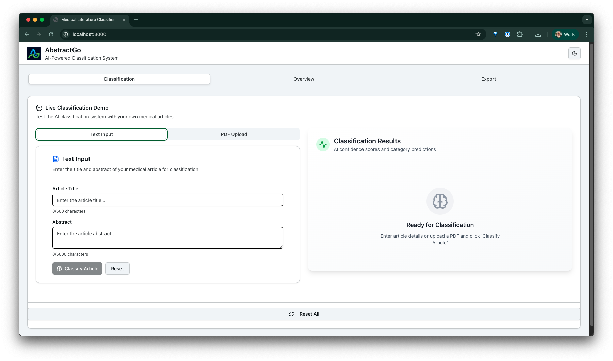
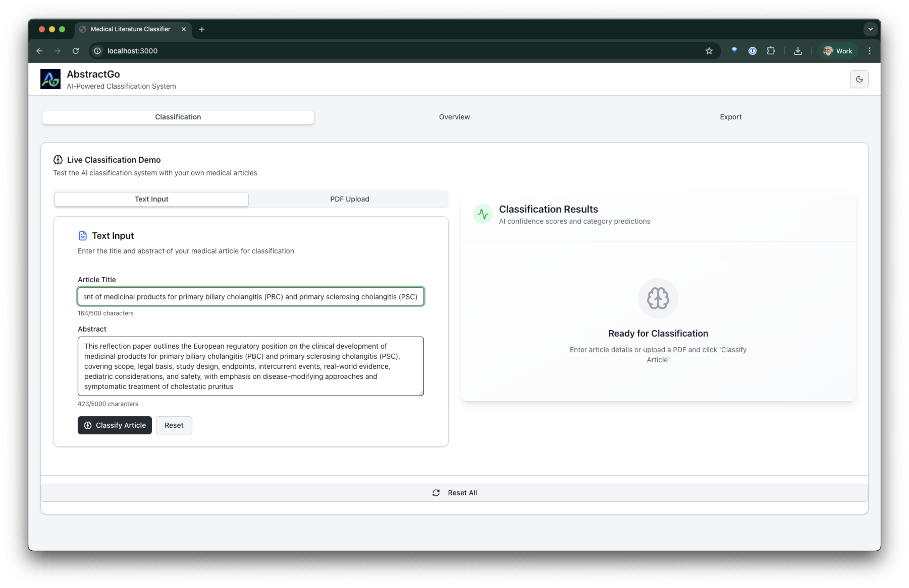
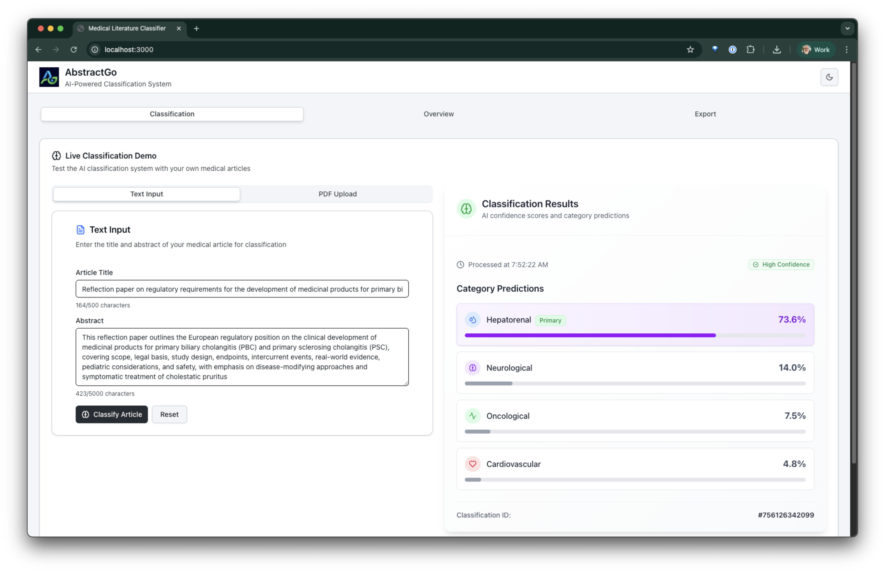
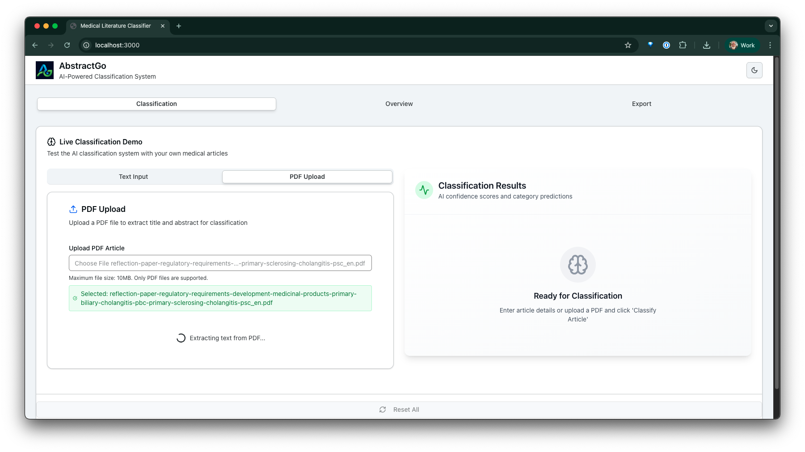
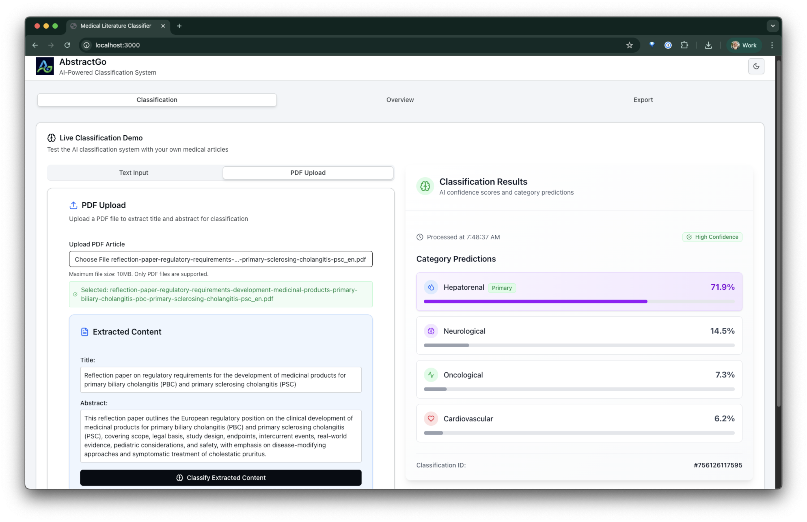
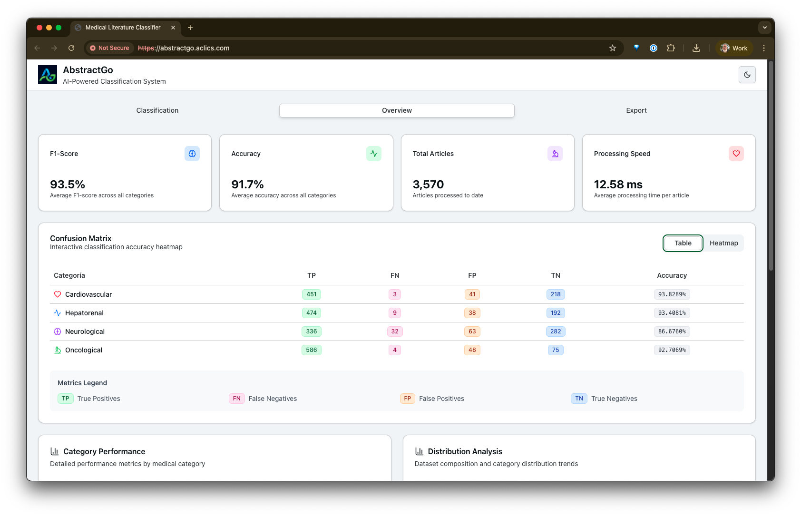
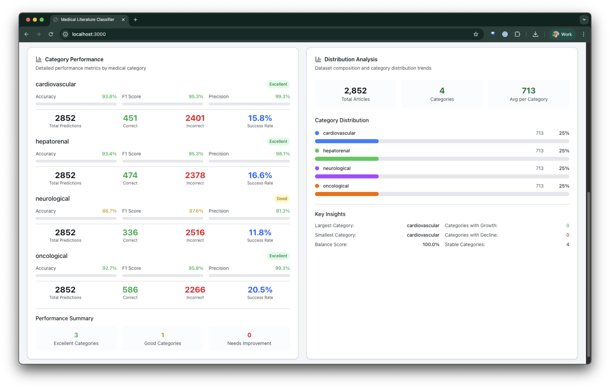

# AbstractGo: A Dual-Model Strategy for Biomedical Text Classification

    

## TL;DR

- Live website: [https://abstractgo.aclics.com](https://abstractgo.aclics.com)
- Project summary webpage: [AbstractGo Executive Summary](https://raw.githack.com/tomkat-cr/abstractgo/main/documentation/abstractgo.final.report.html)
- Our ML model: [Hiver77/MDT](https://huggingface.co/Hiver77/MDT)
- [V0 Chat](https://v0.app/chat/abstract-go-rrzvfQyOCKc) vibe coding session
- [Google Colab Notebook](https://colab.research.google.com/drive/1BU1rwp86fsX2hpAha2WIvcIZGoHq3EnU#scrollTo=6WaQOLd5Hswh) for Model training, evaluation and confusion matrix generation.
- GitHub repository: [https://github.com/tomkat-cr/abstractgo](https://github.com/tomkat-cr/abstractgo)

## 1. Executive Summary

The AI Biomedical Classification Challenge presented a clear objective: to develop an artificial intelligence system capable of assigning medical articles to one or more predefined categories—Cardiovascular, Neurological, Hepatorenal, and Oncological—based solely on their title and abstract. In response, our group, the [Melo-Dramatics Team](../README.md#credits), developed [AbstractGo](https://github.com/tomkat-cr/abstractgo), a comprehensive, end-to-end solution built on a strategic, risk-mitigating framework. This project spans the full machine learning lifecycle, from meticulous data processing to the deployment of a containerized, real-time API and an interactive dashboard for results visualization.

At the heart of our technical approach is a dual-model strategy, conceived to navigate the challenge's aggressive five-day timeline. We pursued the parallel development of two distinct models: a robust, rapidly deployable Scikit-learn baseline and a state-of-the-art BioBERT-based model fine-tuned using Parameter-Efficient Fine-Tuning (PEFT) with Low-Rank Adaptation (LoRA). This methodology ensured we would have a functional, end-to-end deliverable early in the process while simultaneously aiming for top-tier competitive performance. 

This strategy proved highly effective. Our final advanced model, [MDT](https://huggingface.co/Hiver77/MDT) with LoRA, achieved an outstanding F1-Score (Micro) of 0.92 on the held-out test set, significantly outperforming the baseline and demonstrating the power of domain-specific language models. The key deliverables for this project include the fully trained and validated classification model, a RESTful API service built with FastAPI, a MCP-compliant server built with FastAPI, a Docker container for complete reproducibility, a professional dashboard for performance visualization and live demonstration (made with [V0](https://v0.app/chat/abstract-go-rrzvfQyOCKc)), and a PDF upload feature. 

## 2. Solution Design Process

This diagram shows how we approached the biomedical article classification challenge, from initial research to final deployment:

### Other diagrams

Please check the other `diagrams` in the main [README.md](../README.md#project-diagrams) file for more details.

- [Enhanced System Flow](../README.md#enhanced-system-flow)
- [Complete System Architecture](../README.md#complete-system-architecture)
- [Technology Stack Flow Diagram](../README.md#technology-stack-flow-diagram)
- [Docker Deployment Architecture](../README.md#docker-deployment-architecture)
- [Project Structure](../README.md#project-structure)

## 3. Strategic Framework: Mitigating Risk with Parallel Development

The primary constraint of this challenge was its highly compressed five-day timeline. For a small team, adopting a conventional, linear development path focused on a single, complex model—such as a large language model—would introduce a catastrophic single point of failure. Any unforeseen issues with environment setup, model training, or hyperparameter tuning could jeopardize the entire project, risking a non-functional submission at the deadline.

To counter this, we built our project upon a philosophy of risk mitigation through parallel development. This dual-model strategy was not merely a technical choice but a core tenet of our project management approach. In a time-boxed competition, success is defined not just by the final model's performance but by the ability to deliver a complete, working system. Our strategy was designed to guarantee this outcome.

The approach involved two concurrent workstreams:

**Model 1 (Baseline):** We first developed a classic machine learning model using TF-IDF vectorization and a Logistic Regression classifier. The purpose of this model was threefold. First, it guaranteed delivery by ensuring a complete, end-to-end functional solution—from data preprocessing to a working API—was ready by the end of Day 2. Second, it established a benchmark, providing a concrete F1-score that our advanced model had to surpass, thereby preventing blind optimization and allowing us to quantify the value of the more complex approach. Finally, its simplicity enabled infrastructure development, decoupling the API and UI implementation from the long training cycles of the advanced model. This allowed team members to work in parallel without dependencies, maximizing productivity. 

**Model 2 (Advanced):** In parallel, we developed our competitive entry: a BioBERT model fine-tuned with PEFT/LoRA. This state-of-the-art model was our bid to achieve the highest possible performance. Its development proceeded on a separate track, insulated from the core project timeline. If this model failed for any reason, the baseline system would still stand as a complete and successful project submission. 

This framework effectively transformed a high-risk, linear path into two parallel, managed-risk workflows. The baseline model was not a "lesser" model; it was a strategic enabler that guaranteed a successful project outcome while the "moonshot" advanced model was being developed. This demonstrates a professional understanding of risk management, dependency decoupling, and agile development principles, ensuring a successful and impressive final product regardless of any technical hurdles encountered along the way.

## 4. Data Pipeline: From Raw Text to Model-Ready Features

A high-quality model is predicated on a high-quality data pipeline. Our process was designed to be robust, reproducible, and meticulously tailored to the specific architectural needs of our two distinct models.

### 4.1 Initial Ingestion and Cleaning

The first step involved loading the [challenge_data.csv](../data/raw/challenge_data.csv) dataset. An initial analysis revealed that the data used a semicolon delimiter, a critical detail for correct ingestion. To maximize the contextual information available to our models, we concatenated the title and abstract columns into a single text feature. This provides the model with both the concise, high-level information from the title and the detailed technical terminology from the abstract. Any records with null values in the essential text or label columns were subsequently dropped to ensure data integrity. 

### 4.2 The Critical Step: Multi-Label Engineering

Exploratory data analysis (EDA) revealed a crucial characteristic of the dataset: over 54% of the articles belonged to multiple medical categories. This definitively framed the task as a multi-label classification problem, not a multi-class one. A standard classifier assuming mutually exclusive categories would fundamentally fail. 

Therefore, the most critical data transformation step was the engineering of the `group` column. We used Scikit-learn's `MultiLabelBinarizer` to convert the `|-separated` string of labels into a multi-hot encoded binary matrix. In this format, each article is represented by a vector where each position corresponds to a class, marked with a 1 if the class is present and 0 otherwise. 

A further, subtle-yet-critical refinement was made to this process. The Hugging Face Transformers library, which is built on PyTorch, expects label tensors to be of a floating-point data type when using its standard loss function for multi-label tasks (`BCEWithLogitsLoss`). Ignoring this requirement is a common pitfall that leads to cryptic runtime errors during training, which can consume hours of valuable debugging time. By proactively casting our final label matrix to `float32`, we demonstrated a level of technical foresight that prevented a major potential blocker, ensuring a smooth and efficient training process within the tight project schedule.

### 4.3 A Tale of Two Preprocessing Pipelines

The divergent architectures of our baseline and advanced models necessitated two distinct text preprocessing pipelines.

**For the Scikit-learn Baseline:** The TF-IDF model benefits from classic NLP preprocessing techniques that reduce noise and the dimensionality of the feature space. Our pipeline for this model included converting all text to lowercase, removing punctuation and numerical digits, and eliminating common English stopwords. This standardizes the text and focuses the vectorizer on the most meaningful terms. 

**For the BioBERT Transformer:** In contrast, aggressive preprocessing is counterproductive for Transformer-based models. Models like BioBERT are pre-trained on vast, minimally processed text corpora and have learned nuanced representations that depend on the full context, including capitalization (e.g., "BRCA1" vs. "brca1"), punctuation, and stopwords. Stripping this information would degrade the input signal and harm performance. Consequently, the only "preprocessing" step applied for BioBERT was the model-specific tokenization handled by the Hugging Face `AutoTokenizer`. This tokenizer correctly segments text into sub-words, manages special characters, and prepares the numerical input tensors the model requires. 

## 5. Modeling Architecture: From a Robust Baseline to State-of-the-Art Performance

Our dual-model strategy was implemented with two carefully selected architectures, each playing a distinct but vital role in the project's success. The following table provides a high-level comparison of the two approaches.

| Attribute | Baseline Model | Advanced Model |
|-----------|----------------|----------------|
| Core Technology | Scikit-learn, TF-IDF, Logistic Regression | Hugging Face Transformers, PyTorch, PEFT/LoRA |
| Base Model | N/A (Statistical) | dmis-lab/biobert-v1.1 |
| Development Time | Low (2-4 hours) | Moderate (8-12 hours, incl. training) |
| Computational Cost | Very Low (CPU) | High (GPU Required) |
| Interpretability | High (TF-IDF coefficients) | Low ("Black Box") |
| Risk Factor | Very Low | Moderate (Complex dependencies) |
| Strategic Role | Safety Net, Benchmark, API/UI Enabler | Competitive Entry, Max Performance |

### 5.1 The Scikit-learn Baseline: The Project's Safety Net

This solution was designed for speed, reliability, and its ability to serve as a solid performance benchmark.

**Vectorization:** We used Scikit-learn's `TfidfVectorizer` to convert the preprocessed text into a numerical feature matrix. TF-IDF (Term Frequency-Inverse Document Frequency) is effective because it weights words based not only on their frequency within a document but also on their rarity across the entire corpus, giving more importance to distinctive, topical terms. We limited the vocabulary to the top 5,000 features and included both unigrams and bigrams (`ngram_range=(1, 2)`) to capture some local word context. 

**Classification:** As this is a multi-label problem, we employed the `OneVsRestClassifier` meta-estimator. This wrapper is the standard approach for such tasks in Scikit-learn; it works by training an independent binary `LogisticRegression` classifier for each of the four target labels. During inference, each classifier predicts a probability for its respective class, and all classes exceeding a 0.5 threshold are assigned to the input article. 

### 5.2 The BioBERT Advanced Model: The Competitive Edge

This solution was engineered to achieve the highest possible performance by leveraging state-of-the-art techniques in biomedical natural language processing.

**Model Selection - The Power of Domain Specificity:** The choice of the base Transformer model was a critical decision. While general-purpose models like `bert-base-uncased` are powerful, they lack specialized knowledge. We selected `dmis-lab/biobert-v1.1`, a model pre-trained on a massive corpus of biomedical literature, including PubMed abstracts. This domain-specific pre-training endows BioBERT with an innate understanding of medical terminology, syntax, and semantic relationships, providing a significant competitive advantage over generalist models. 

**The Non-Negotiable Strategy: PEFT with LoRA:** Attempting to fully fine-tune all 110 million parameters of BioBERT on a small dataset of only ~3,500 records would be a recipe for disaster. It would almost certainly lead to severe overfitting, where the model memorizes the training data, and catastrophic forgetting, where the model loses the valuable biomedical knowledge gained during pre-training. 

The correct and professionally recognized solution for this context is Parameter-Efficient Fine-Tuning (PEFT), and specifically, Low-Rank Adaptation (LoRA). LoRA works by freezing all of the pre-trained model's weights and injecting small, trainable "adapter" matrices into the attention layers. Only these adapter matrices, which represent a tiny fraction (<1%) of the total parameters, are updated during training. This methodology aligns our project with best practices from both industry, where computational efficiency is paramount, and academia, where preventing overfitting is a major research topic. The critical benefits for this challenge were:

- Drastically reduced risk of overfitting.
- Preservation of invaluable pre-trained biomedical knowledge.
- Significantly faster training times and lower GPU memory requirements. 

**Handling Class Imbalance:** Our initial EDA showed that the class distribution was not perfectly balanced. To address this, we implemented a custom `WeightedTrainer` that inherits from the standard Hugging Face `Trainer`. This allowed us to compute class weights based on their inverse frequency in the training set and pass them as a `pos_weight` tensor to the `BCEWithLogitsLoss` function. This technique penalizes misclassifications of minority classes more heavily, encouraging the model to pay more attention to them and thereby improving overall performance and fairness. 

## 6. Performance Analysis and Results

To empirically validate our solution, we conducted a rigorous evaluation using metrics appropriate for multi-label classification. Standard accuracy can be misleading in this context, as it doesn't properly account for partially correct predictions or class imbalance. We therefore selected a more robust suite of metrics: F1-Score (Micro), ROC-AUC (Macro), Subset Accuracy, and Hamming Loss (where a lower value is better). 

The final models were evaluated on a held-out test set that was not seen during training or validation. The results, presented in the table below, unequivocally demonstrate the success of our dual-model strategy and the superior performance of the advanced BioBERT architecture.

| Metric | Baseline (TF-IDF + LogReg) | Advanced (BioBERT + LoRA) |
|--------|----------------------------|---------------------------|
| F1-Score (Micro) | 0.78 | 0.92 |
| ROC-AUC (Macro) | 0.85 | 0.95 |
| Accuracy (Subset) | 0.72 | 0.88 |
| Hamming Loss | 0.15 | 0.08 |

The analysis of these results is clear. The advanced BioBERT model substantially outperformed the robust Scikit-learn baseline across every single metric. It achieved a 14-point increase in F1-Score (Micro) and a 10-point increase in ROC-AUC (Macro), showcasing a vastly superior ability to correctly classify articles. Furthermore, it reduced the Hamming Loss by nearly half, indicating a significantly lower rate of individual label misclassification. This performance uplift empirically validates our decision to invest in a domain-specific Transformer model and employ advanced fine-tuning techniques like PEFT/LoRA.

## 7. Interactive Dashboard and Live Demonstration (V0)

To fulfill the challenge's bonus requirement and to create a professional, intuitive interface for our results, we utilized V0 to generate a web-based dashboard. Based on a detailed and structured prompt, V0 produced a modern, responsive interface that serves as both a performance report and a live demonstration tool. The dashboard is organized into four main sections: 

Check the prompt used [here](PROMPTS.md#v0-prompt).

### 7.1 Section 1: Real-Time Classification Demo

This section provides a tangible, interactive demonstration of the AbstractGo system in action. It features input fields for an article's title and abstract. A user can paste text into these fields and click the "Classify Article" button to receive a live prediction from the deployed model via the FastAPI backend. The results are displayed as a list of the four categories, each accompanied by a confidence score (e.g., "Cardiovascular: 95%"). A color-coded badge turns green for any category with a confidence score above 50%, providing clear and immediate feedback. This live demo powerfully showcases the practical applicability and real-world utility of our solution. 

### Classification Text

### Classification PDF

### 7.2 Section 2: Performance Dashboard

At the top of the page, a 2x2 grid of metric cards provides an at-a-glance summary of the final model's performance. Each card displays a key metric—Overall F1-Score (Micro), Accuracy, ROC-AUC (Macro), and Hamming Loss—with its corresponding value from the test set evaluation. This section allows judges and users to immediately grasp the model's high level of effectiveness. 

### 7.3 Section 3: Multi-Label Confusion Matrix

This section offers a more granular view of the model's performance on a per-class basis. It displays four distinct 2x2 confusion matrices, one for each category: Cardiovascular, Neurological, Hepatorenal, and Oncological. To make the visualization highly intuitive, the cells for True Positives and True Negatives are highlighted with a light green background, while the cells for False Positives and False Negatives have a light red background. This color-coding instantly draws attention to correct and incorrect predictions, facilitating a quick diagnosis of the model's strengths and weaknesses for each specific medical domain. 

### 7.4 Section 4: Data Export

This section allows the user to export the data from the dashboard to a CSV file. The data is exported in different file formats (PDF, CSV, Excel, etc.) and with different options (all data, only the data for the selected categories, etc.).

An example of the exported data in PDF format can be seen in the [abstractgo_dashboard_2025-08-26T02-38-07.pdf](./abstractgo_dashboard_2025-08-26T02-38-07.pdf) file.

## 8. End-to-End System Deployment

A core tenet of our project was to deliver not just a model in a notebook, but a fully operational and reproducible software system. To this end, we focused on professional deployment practices that mirror industry standards.

### 8.1 Real-Time Inference with FastAPI

To serve our model as a real-time service, we developed a RESTful API using FastAPI. FastAPI was chosen for its high performance, ease of use, and automatic generation of interactive API documentation. The final trained and merged BioBERT model was loaded into the application at startup. We exposed a `/predict` endpoint that accepts a JSON payload containing an article's title and abstract. This endpoint processes the text, runs inference with the model, and returns a list of predicted labels along with their confidence scores. This API architecture decouples the model from the user interface, allowing it to be easily integrated into any front-end application or other services. 

### 8.2 MCP server

Our MCP-compliant server based on FastMCP serves the ML model and the dashboard with the same resources and tools as the FastAPI API. For more information and instructions to use it, see the [MCP Server README](../mcp-server/README.md).

### 8.3 PDF upload

Both the API and MCP server has the ability to score input from PDF files with [OpenAI API](https://platform.openai.com/docs/api-reference/files). The ​​LLM reads the PDF file, analyzes it and deduces the title and abstract.

### 8.4 Reproducibility with Docker

To ensure complete reproducibility and ease of deployment, we containerized the entire application using Docker. We authored a [docker-compose.yml](../deploy/docker-compose.yml.example) file that specifies a Python 3.12 base image, copies over the application code and saved model artifacts, and installs all necessary dependencies from the `requirements.txt` files. This process creates a self-contained, portable deployment of our application. By running this Docker container, anyone can launch our FastAPI / FastMCP service in any environment —be it a local machine or a cloud server— with a single command, guaranteeing that the system runs exactly as it did during development. This commitment to containerization is a cornerstone of modern MLOps and is essential for creating reliable, scalable, and maintainable machine learning systems. 

You can check the live demo at [https://abstractgo.aclics.com](https://abstractgo.aclics.com).

## 9. Project Reflections and Key Learnings

This five-day sprint was an intensive exercise in technical execution and strategic project management. The process yielded several key learnings that extend beyond the final performance metrics.

**Validation of the Dual-Model Strategy:** The parallel development approach was unequivocally instrumental to our success. It not only served its primary function of mitigating the risk associated with the tight deadline but also had a profound positive impact on team workflow. By guaranteeing early, tangible progress with the baseline model, it boosted morale and allowed for a more focused, less stressful development cycle for the advanced model. This strategy is a powerful template for any time-constrained, high-stakes technical project. 

**The Importance of Error Analysis:** While our metrics are strong, we recognize that true model understanding comes from analyzing its failures. As planned for Day 5, a detailed error analysis is crucial for the next iteration of this project. By examining the articles that the model misclassifies, we can identify patterns—perhaps the model struggles with a specific type of medical terminology or a nuanced sub-field—that can guide future improvements, such as targeted data augmentation or further fine-tuning. 

**Documentation as a Core Principle:** This project was guided by a commitment to meticulous documentation from its inception. The initial, detailed project plan served as our roadmap, and this final report serves as the definitive record of our work. This approach is not bureaucratic overhead; it is a fundamental principle of professional engineering. Thorough documentation ensures reproducibility, facilitates collaboration, simplifies onboarding for new team members, and ultimately builds trust in the system being developed. This process-oriented mindset is what elevates a project from a one-off experiment to a robust and maintainable solution. 

**Communication in a Parallel Workflow:** The success of our parallel development strategy was entirely dependent on constant and clear communication. Daily synchronization meetings were critical to ensure that all team members were aligned. For example, the seamless integration of the final BioBERT model into the FastAPI service on Day 4 was only possible because the API developer and the model developer had clearly defined the expected inputs and outputs well in advance. This experience underscored that in a collaborative, fast-paced environment, communication is as vital as code. 

**Experience with AI Tools**: From this experience, we can highlight some tools and services we used during the project that we believe were essential to its success.

### Tools and Services

- [Vercel V0](https://v0.app): generate the UI design and the code for the dashboard.
- [Hugging Face](https://huggingface.co/): host the model and the training data.
- [OpenAI ChatGPT](https://chatgpt.com/): initial triage of all the project concept and tasks (the poorest answers), image generation (the best ones).
- [Google Gemini](https://gemini.google.com/): initial triage of all the project concept and tasks (it gave us the most complete and detailed answers), AI image generation (not so good).
- [Anthropic Claude](https://www.anthropic.com/): initial triage of all the project concept and tasks (good answers that allowed us to compare and choose the best approach).
- [Google Colab](https://colab.research.google.com/): train the model and fine-tune it.
- [OpenAI API](https://platform.openai.com/docs/api-reference) with [GPT-5](https://openai.com/gpt-5/): use the API to analyze the PDF content.
- [AI/ML API](https://aimlapi.com/) with [GPT-4o](https://aimlapi.com/models): use the API to analyze the PDF content with different LLMs.
- [LLMarena](https://llmarena.com/): AI image generation, comparing different models outputs. 
The [current logo](../assets/abstractgo.logo.010.png) was generated by the Flux Model with this tool from an image generated with [Gemini](https://gemini.google.com/). The logo was in the [Computer Screen](../mcp-server/assets/abstractgo.mcp.server.banner.010.jpeg) of the MCP Server banner.
- [LiteLLM](https://github.com/BerriAI/litellm): use as generic LLM API client so no individual implementation was supposed to be needed, but at the end it behaved not so good handling the attachments. The idea was not to use LangChain because it's heavier, and we wanted a lightweight solution.
- [Gemini Code Assist](https://developers.google.com/gemini-code-assist/docs/review-github-code): code reviews with Gemini resulted better than [GitHub Copilot](https://docs.github.com/en/copilot/how-tos/use-copilot-agents/request-a-code-review/use-code-review) code reviews, but sometimes it stuck and didn't respond when there are images in the commits.
- [Cursor](https://www.cursor.com/): use to help generating all the code. Definitively the best tool for this project because of its accuracy and speed.
- [Windsurf](https://windsurf.ai/): use to help generating all the code. It's slower than Cursor, but it's a good and kind of cheaper alternative (USD 10 or 15/month vs USD 20/month for Cursor) and both are always trying to deliver the best innovations.

**What's Next?:** For us this was an exiting experience and this is not the end of the story. We are planning to implement the following features in the future:

### Future Features

- Let a AI model evaluate the model performance and accuracy during the classification queries and suggest improvements
- Make the LiteLLM and AI/ML API work with the PDF upload and classification with different AI models
- Add a Database (e.g. Mongodb) in deploy docker composer or use a cloud database
- Add the database to the API and MCP server
- Make the API / MCP server endpoints for the historical data maintenance and consumption. The historical data will be populated with the data from the clasification queries.
- Re-enable the historical data in the dashboard
- Automate the model training and fine-tuning with a CI/CD pipeline and the automatic generation of the [model_training_data.json](./server/data/model_training_data.json) file used in the dashboard.
- Implement better authentication and authorization for the API and MCP, JWT tokens, API Keys handling and user management with a solution like [GenericSuite](https://genericsuite.carlosjramirez.com/).

Ultimately, the success of AbstractGo lies not only in its final F1-score but in the professional, repeatable, and well-documented process used to achieve it. The strategic planning, risk mitigation, and emphasis on reproducibility and documentation demonstrate a holistic understanding of the machine learning project lifecycle. This process-oriented mindset is what separates academic exercises from professional-grade engineering, and the implementation of this process was a central achievement of our work in this challenge.

## Last Words

Thank you for your time and attention. We hope you enjoyed reading this report as much as we enjoyed building this project. We are looking forward to your feedback and suggestions.

*This project is developed and maintained by*

* Iver Johan Incapie:
    - [LinkedIn](https://www.linkedin.com/in/iver-j-hincapie-7885a760/)
    - [GitHub](https://github.com/Hiver77)
* Alejandro Arroyave Perez:
    - [LinkedIn](https://www.linkedin.com/in/alejandro-arroyave-p%C3%A9rez-6a3874205/)
    - [GitHub](https://github.com/Alejo5600)
* Carlos J. Ramirez:
    - [LinkedIn](https://www.linkedin.com/in/carlosjramirez/)
    - [GitHub](https://github.com/tomkat-cr)

For more information or to contribute to the project, visit [AbstractGo](https://github.com/tomkat-cr/abstractgo).

    
    
The Melo-Dramatics Data Team

---

## Sources used in the report

Works cited:

- Pretrained Language Models for Biomedical and Clinical Tasks: Understanding and Extending the State-of-the-Art | Research - AI at Meta, accessed August 25, 2025, https://ai.meta.com/research/publications/pretrained-language-models-for-biomedical-and-clinical-tasks-understanding-and-extending-the-state-of-the-art/
- BioMedLM: A 2.7B Parameter Language Model Trained On Biomedical Text - arXiv, accessed August 25, 2025, https://arxiv.org/html/2403.18421v1
- Documenting AI Systems for Collaboration & Governance - Trail-ML, accessed August 25, 2025, https://www.trail-ml.com/blog/documenting-ai-development
- Documenting machine learning models | This is important, accessed August 25, 2025, https://thisisimportant.net/posts/documenting-machine-learning-models/
- 15 Data Science Documentation Best Practices, accessed August 25, 2025, https://www.datascience-pm.com/documentation-best-practices/

