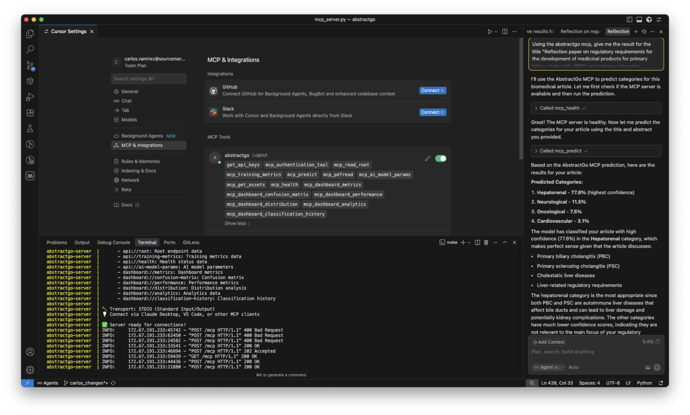

# AbstractGo MCP Server and Client Configuration


A Model Context Protocol (MCP) server that exposes the AbstractGo biomedical article classification API to AI clients like Claude Desktop, VS Code, and other MCP-compatible applications.

## Features

This MCP server provides comprehensive biomedical article classification and analysis capabilities:

### 🔐 User Authentication
- `get_api_keys`: Get API keys from environment
- `mcp_authentication_tool`: Authenticate user with API key

### 📊 Model Training & Metrics
- `mcp_training_metrics`: Get training metrics for the model
- `mcp_ai_model_params`: Get AI model parameters

### 🔬 Article Classification
- `mcp_predict`: Predict categories for biomedical articles
- `mcp_pdfread`: Read PDF files and extract title/abstract

### 📈 Dashboard Analytics
- `mcp_dashboard_metrics`: Get dashboard metrics
- `mcp_dashboard_confusion_matrix`: Get confusion matrix
- `mcp_dashboard_performance`: Get performance metrics
- `mcp_dashboard_distribution`: Get distribution analysis
- `mcp_dashboard_analytics`: Get analytics data
- `mcp_dashboard_classification_history`: Get classification history

### 🛠️ System & Health
- `mcp_read_root`: Get root endpoint information
- `mcp_health`: Health check endpoint
- `mcp_get_assets`: Get assets from local filesystem

### 📂 Resources
- `user://login/{api_key}`: User login data
- `api://root`: Root endpoint data
- `api://training-metrics`: Training metrics data
- `api://health`: Health status data
- `api://ai-model-params`: AI model parameters
- `dashboard://metrics`: Dashboard metrics
- `dashboard://confusion-matrix`: Confusion matrix
- `dashboard://performance`: Performance metrics
- `dashboard://distribution`: Distribution analysis
- `dashboard://analytics`: Analytics data
- `dashboard://classification-history`: Classification history

## Installation

1. **Clone the repository:**
```bash
git clone https://github.com/tomkat-cr/abstractgo.git
```

2. **Install Python dependencies:**
```bash
cd abstractgo/mcp-server
make install
```

3. **Run the server:**

**Start the MCP server:**
```bash
make run
```

**Start the MCP server with the MCP Inspector:**
```bash
make run-mcp-inspector
```

## MCP Client Configuration

You can use the MCP server in clients like VS Code, Cursor or Claude Desktop.

### With Standard Input/Output (stdio) Transport

The `Stdio Transport` connection method allows MCP clients to be connected to the MCP server locally. You must do the [installation](#installation) step but the server doesn't need to be running.

#### Claude Desktop

Add this configuration to your `claude_desktop_config.json`:

```json
{
  "mcpServers": {
    "abstractgo": {
      "command": "sh",
      "args": [
        "/absolute/path/to/abstractgo/mcp-server/run_mcp_server.sh"
      ],
      "env": {
        "AG_API_KEY": "ag-api-key-123"
      }
    }
  }
}
```

#### VS Code MCP Extension

Add to your VS Code settings or `.vscode/mcp.json`:

```json
{
  "mcp": {
    "servers": {
      "abstractgo": {
        "command": "sh",
        "args": [
          "/absolute/path/to/abstractgo/mcp-server/run_mcp_server.sh"
        ],
        "env": {
          "AG_API_KEY": "ag-api-key-123"
        }
      }
    }
  }
}
```

### Streamable HTTP Transport

The `HTTP Transport` connection method allows MCP clients to be connected to live MCP servers. You must do the [installation](#installation) step and the server needs to be started and running.

#### Claude Desktop

Add this configuration to your `claude_desktop_config.json`:

```json
{
  "mcpServers": {
    "abstractgo": {
      "url": "http://localhost:8070/mcp",
      "headers": {
        "AG_API_KEY": "ag-api-key-123"
      }
    }
  }
}
```

#### VS Code MCP Extension

Add to your VS Code settings or `.vscode/mcp.json`:

```json
{
  "mcp": {
    "servers": {
      "abstractgo": {
        "url": "http://localhost:8070/mcp",
        "headers": {
          "AG_API_KEY": "ag-api-key-123"
        }
      }
    }
  }
}
```

NOTES:
- Set the `AG_API_KEY` environment variable to your AbstractGo API key in the server's `env` section.

## Usage Examples

Once connected to an MCP client, you can interact with the server using natural language:

### Basic Operations
- "Authenticate me with my API key"
- "Get the training metrics for the model"
- "Predict categories for this biomedical article"
- "Show me the dashboard performance metrics"

### Article Classification
- "Read this PDF and classify the article"
- "Predict the category for this title and abstract"
- "Get the confusion matrix for model performance"

### Dashboard Analytics
- "Show me the distribution analysis"
- "Get the classification history"
- "Display the current dashboard metrics"

### Prompt with real life data

You can use the AbstractGo MCP server to classify articles and get the results in a natural language format.

```
Using the abstractgo mcp, give me the result for the
title "Reflection paper on regulatory requirements for the development of medicinal products for primary biliary cholangitis (PBC) and primary sclerosing cholangitis (PSC)"
and abstract "This reflection paper outlines the European regulatory perspective on the clinical development of new medicinal products for primary biliary cholangitis (PBC) and primary sclerosing cholangitis (PSC). It covers scope, legal basis, and relevant guidelines, and provides recommendations on study design, endpoints, estimands, patient population, and safety considerations for both first-line and second-line therapies, as well as symptomatic treatment of cholestatic pruritus. The document also discusses real-world evidence, paediatric considerations, and the use of histology and non-invasive methods to support assessment, aiming to define development strategies for these rare, slowly progressive cholestatic liver diseases and to inform future guidance."
```

The result will be:

```
Based on the AbstractGo MCP prediction, here are the results for your article:
Predicted Categories:
1. Hepatorenal - 77.8% (highest confidence)
2. Neurological - 11.5%
3. Oncological - 7.5%
4. Cardiovascular - 3.1%

The model has classified your article with high confidence (77.8%) in the Hepatorenal category, which makes perfect sense given that the article discusses:
1. Primary biliary cholangitis (PBC)
2. Primary sclerosing cholangitis (PSC)
3. Cholestatic liver diseases
4. Liver-related regulatory requirements

The hepatorenal category is the most appropriate since both PBC and PSC are autoimmune liver diseases that affect bile ducts and can lead to liver damage and potentially kidney complications. The other categories have much lower confidence scores, indicating they are not relevant to the main focus of your regulatory reflection paper.
```



## Architecture

The server is built using:
- **FastMCP**: Modern Python MCP framework for rapid development
- **Pydantic**: Data validation and serialization
- **AsyncIO**: Asynchronous operations for better performance

### Data Models
The server integrates with AbstractGo's biomedical article classification system, supporting:
- Article classification with title and abstract
- PDF document processing
- Model performance metrics and analytics
- Dashboard data visualization

### API Integration
The MCP server acts as a bridge to the AbstractGo API, providing:
- Authentication and API key management
- Direct access to model endpoints
- Real-time dashboard data
- File processing capabilities

## Development

### Extending the Server
To add new tools, create functions decorated with `@mcp.tool()`:

```python
@mcp.tool()
async def my_new_tool(params: MyModel) -> Dict[str, Any]:
    """Description of what this tool does"""
    # Implementation
    return {"success": True, "data": result}
```

### Adding Resources
To add new resources, use the `@mcp.resource()` decorator:

```python
@mcp.resource("mydata://endpoint")
async def my_resource() -> str:
    """Get my data as a resource"""
    data = await get_my_data()
    return json.dumps(data, indent=2)
```

## Transport Modes

Currently supports:
- **STDIO**: Standard input/output for local clients (default)
- **Future**: HTTP/SSE transport for remote clients (planned)

## Logging

The server provides detailed logging for debugging and monitoring:
- Tool invocations and parameters
- Data validation errors
- API integration operations
- Performance metrics

## License

This MCP server follows the MIT [LICENSE](./LICENSE), as the AbstractGo project.
